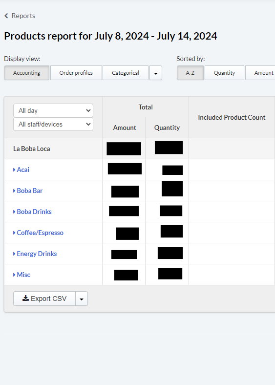
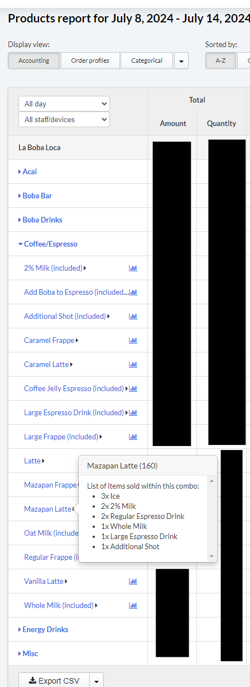

## Table of contents

- [Description](#description)
- [Example](#example)
- [Notes](#notes)
- [Potential updates](#potential_updates)

## Description

- The purpose of this script is to retrieve products sold between 2 date ranges in lightspeed's backoffice.
  - The script now splits the two dates into 1 week chunks. The weeks start on Monday and end on Sunday. If the first date is not on a Monday then the first week will start on whatever day it is.
  - Each week is a separate sheet in the workbook.
- This data can then be used to get exact product usage/costs.
- Lightspeed currently does not offer a way for their users to download the data from the popover from the products sold report.
- The goal was to use selenium and python to scrape the popover data fron the products sold report and output to an excel file. That way it is much easier for us to analyze trends of sales.

## Example

- From the image below products are grouped by their inventory category.

- Each category needs to be expanded before the relevant popover can be scraped.
- Each item has the number of times a specific modifier was chosen with that item.

## Notes

- The script has sleep commands which increases run time. These sleep commands exist because there are times where something has not properly loaded even though some commands are by default supposed to wait for them to load. The sleep commands are a quick solution to that problem. The run time only becomes a problem when the user wants months of data at once which usually won't be the case. 
    - It took the script around 4 hours to do 9 months of data and 1 week should take a few minutes. 

## Potential updates
- The main data extrated is the number of regulars and larges that are ordered for each item. It might be a good idea to parse more of the popover data.